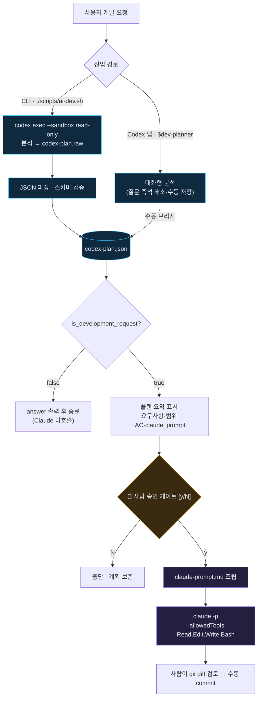

# cc-pipe — Codex × Claude 로컬 AI 개발 파이프라인

사용자의 자연어 개발 요청을 **Codex가 분석·계획(Planner)** 하고, 사람이 승인한 뒤 **Claude Code CLI가 실제 코드를 구현(Builder)** 하는 단순 로컬 파이프라인.

```bash
./scripts/ai-dev.sh "로그인 5회 실패 시 계정을 잠금 처리해줘"
```

---

## 개요

- **단일 진입점**: 명령 하나로 요청 분석 → 계획 → 승인 → 구현까지 이어진다.
- **역할 분리**: Codex는 계획만, Claude는 구현만. Codex는 Claude를 직접 호출하지 않는다.
- **사람 개입(Human-in-the-loop)**: Claude 자동 호출 전 반드시 y/N 승인 게이트를 통과한다.
- **추적성**: 모든 실행 산출물이 `docs/ai/runs/{timestamp}/`에 보존된다.
- **비파괴**: 자동 commit/merge 없음. 변경은 사람이 `git diff` 확인 후 직접 commit.

| 구성요소 | 역할 | 책임 | 금지 |
|----------|------|------|------|
| **Codex** | Planner | 요청 판별, 요구사항 구체화, 계획·구현 프롬프트 생성 | 코드 수정, 테스트 실행, Claude 직접 호출 |
| **Claude CLI** | Builder | 승인된 계획 기반 구현, 테스트 | 범위 초과 리팩터링, 임의 스키마/API 변경 |
| **사람** | Gate | 실행 승인, `git diff` 검토, commit 결정 | — |

---

## 설치 (다른 프로젝트에 적용)

cc-pipe를 설치할 프로젝트 루트에서 아래 원라이너를 실행한다(저장소 public). 전체 명령·옵션은 [`INSTALL.md`](INSTALL.md) 참고.

**Windows (PowerShell)**
```powershell
$repo="https://github.com/kwjdia/cc-pipe.git"; $tmp=Join-Path $env:TEMP ("cc-pipe-"+[guid]::NewGuid()); git clone --depth 1 $repo $tmp; & (Join-Path $tmp "install.ps1") -TargetPath (Get-Location); Remove-Item -LiteralPath $tmp -Recurse -Force
```

**macOS / Linux**
```sh
tmp=$(mktemp -d); trap 'rm -rf "$tmp"' EXIT; git clone --depth 1 https://github.com/kwjdia/cc-pipe.git "$tmp" && sh "$tmp/install.sh" "$(pwd)"
```

설치되는 것: `dev-planner` 스킬 · `scripts/ai-dev.sh`·`ai-build.sh` · `docs/ai/runs/` · `.cc-pipe/`(업데이터+`version.json`) · `AGENTS.md`/`CLAUDE.md` 관리 블록(기존 내용 보존).

### 자동 업데이트

설치본에서 `./scripts/ai-dev.sh`를 실행하면 시작 시 원격 `main`과 버전을 비교해 최신이 아니면 **자동 재설치 후 진행**한다(오프라인/실패 시 경고만, fail-open). 비활성화는 `CC_PIPE_NO_UPDATE=1`.

수동 확인/적용:
```sh
sh ./.cc-pipe/update.sh --check-only   # 확인만
sh ./.cc-pipe/update.sh                # 확인 + 적용
```
```powershell
.\.cc-pipe\update.ps1 -CheckOnly
.\.cc-pipe\update.ps1
```

---

## 동작 흐름

계획 단계는 **CLI 스크립트**와 **Codex 앱** 두 경로로 진입할 수 있으며, 두 경로 모두 동일한 `codex-plan.json`으로 수렴한다.



> 시각화된 상세 흐름도: [`docs/ai-dev-pipeline-flow.html`](docs/ai-dev-pipeline-flow.html)

---

## 빠른 시작

### 사전 요구사항
1. **git 저장소** — `git init` 완료 상태여야 구현 후 `git diff` 검토가 의미 있다.
2. **POSIX 셸** — 스크립트는 bash 기반. Windows에서는 **Git Bash 또는 WSL**에서 실행(PowerShell 불가).
3. **CLI 설치·로그인** — `codex`, `claude`, `python 3`가 PATH에 있어야 한다.

### 사용법
```bash
# 전체 파이프라인 (분석 → 승인 → 구현)
./scripts/ai-dev.sh "개발 요청 내용"

# 이미 만들어진 계획으로 빌드만 (Codex 앱 경로 등)
./scripts/ai-build.sh docs/ai/runs/<timestamp>
```

인자 없이 실행하면 사용법을 출력한다.

---

## 파일 구조

```text
.
├── AGENTS.md                          # Codex(Planner) 역할·규칙
├── CLAUDE.md                          # Claude(Builder) 역할·규칙 (세션 자동 로드)
├── .agents/skills/dev-planner/
│   └── SKILL.md                       # 개발요청 판별·계획 수립 스킬 (Codex 자동 탐색)
├── scripts/
│   ├── ai-dev.sh                      # CLI 진입점: 분석→파싱→검증→분기
│   └── ai-build.sh                    # 승인 게이트→Claude 빌드 (CLI·앱 공용)
├── docs/
│   ├── ai-dev-pipeline-spec.md        # 요구사항 명세서
│   ├── ai-dev-pipeline-flow.html      # 시각화 흐름도
│   └── ai/runs/                       # 실행 산출물 (gitignore, .gitkeep만 추적)
├── .gitattributes                     # *.sh LF 고정
└── .gitignore
```

---

## 실행 산출물

각 실행은 `docs/ai/runs/{timestamp}/`에 다음을 남긴다.

| 파일 | 의미 |
|------|------|
| `user-prompt.txt` | 사용자 원본 요청 |
| `codex-plan.raw` | Codex 원본 출력 (CLI 경로) |
| `codex-plan.json` | 파싱·검증된 개발 계획 · **수렴 지점** |
| `claude-prompt.md` | Claude에 전달된 최종 구현 프롬프트 |
| `claude-result.md` | Claude 실행 결과 |

---

## 핵심 규칙 (스펙 요약)

- **Codex 출력**은 순수 JSON(`dev-planner` 스키마)만. 개발요청이면 요구사항·범위·단계·테스트 기준·`claude_prompt`를, 아니면 `is_development_request:false` + `answer`를 출력한다.
- **스키마 검증**: `is_development_request`가 true면 `request_summary`·`development_plan`·`claude_prompt` 필수. 위반 시 중단.
- **승인 요약**에 포함 범위·제외 범위·Acceptance Criteria·실제 `claude_prompt`를 모두 노출해 "무엇을 승인하는지" 보이게 한다.
- **비대화형 대응**: `claude -p`는 되물을 수 없으므로, 미해결 `questions`가 있으면 경고하고 계획의 `assumptions` 기준으로 진행하며 추정 부분을 리스크로 남긴다.
- **신규 파일 생성**을 위해 Claude에 `Write` 툴을 허용한다(`Edit`는 기존 파일 전용).

전체 요구사항은 [`docs/ai-dev-pipeline-spec.md`](docs/ai-dev-pipeline-spec.md) 참고.

---

## 알려진 제약 (PoC)

이 파이프라인은 **PoC 용도**다. 다음을 지킨다.

1. 대규모 리팩터링, 인증/인가/결제/DB schema 변경에 바로 사용하지 않는다.
2. 초기에는 작은 validation·메시지 수정·테스트 보강으로 검증한다.
3. Claude 실행 전 항상 Codex 계획을, 실행 후 항상 `git diff`를 사람이 확인한다.
4. 자동 commit·자동 merge는 하지 않는다.
5. `codex exec` 비대화형에서 `$dev-planner` 명시 호출은 문서상 미확정 — 스크립트가 프롬프트에 규칙을 인라인 재기술해 폴백을 둔다.
